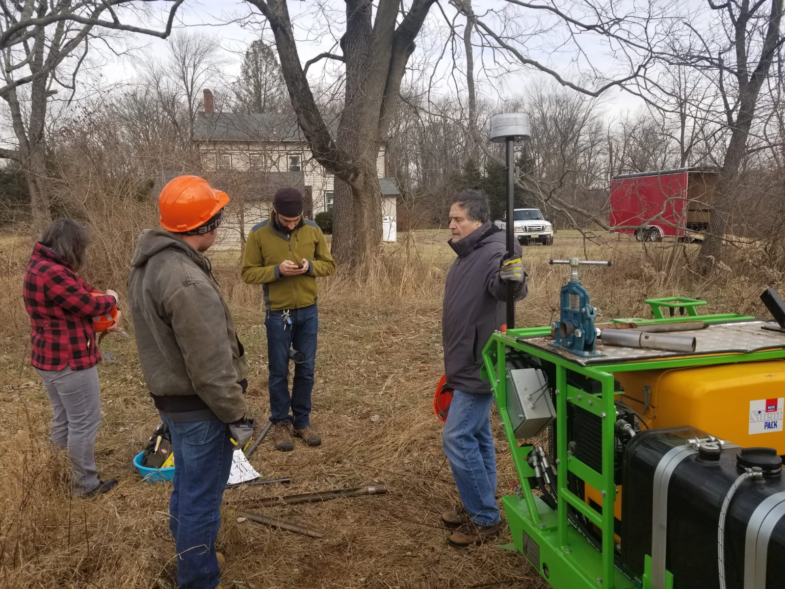
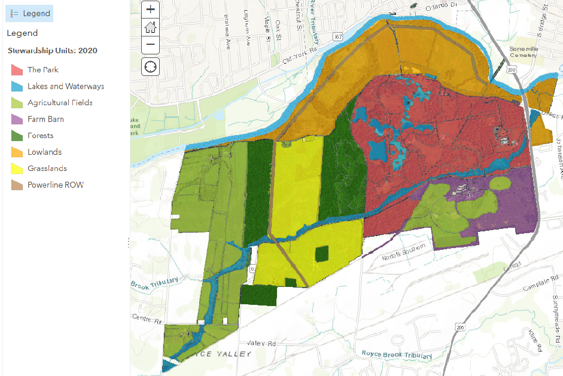
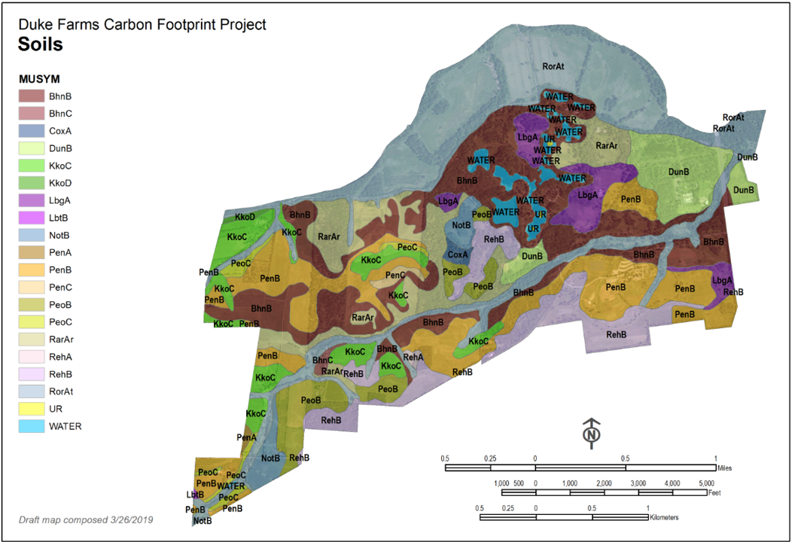

.row[
.col-7[
.title[
###Duke Farms Carbon Project.
]
 

.subtitle[
#### <span style="color: red;">Duke Fields - Impact of land use and soil series on soil carbon stock</span>
##### Project update, 14 April 2021
]
.author[
##### Daniel Gimenez, Professor.<br/>Stephanie Murphy, Dr.<br/>Ewan Oleghe, Dr.
]

.affiliation[
##### Department of Environmental Sciences <br> Rutgers, The State University of New Jersey
]

]

.col-5[

.logo[
```{r echo = FALSE}

```
]
<br>
<br>
---
Slides:<br> 14 slides

Data set:<br> [**AVAILABLE ON REQUEST**](#?)


]

]


---
class: center, middle

### Part 1: Sampling

---
##### 1.1. Field Sampling
  
--
###### 1.1.1.) ...  landuse
  
```{r echo = FALSE, out.width="70%"}

```

---
###### 1.1.2.) ...  and soil series
  
```{r echo = FALSE, out.width="75%"}

```
---
class: center, middle

### Part 2. Summary & Statistics


---
###### **Table 1:** Number of samples by landuse and soil series.
Landuse     |number|<-   |      |  Soil|series |    ->|    |
------------|-----|------|------|------|-------|------|------
            |     | PeoC | PenB |KkoC  |KkoD   |PeoB  | RehB    
Agriculture |333  |32    | 140  |143   |18     | -    | -   
Grassland   |443	|56    | 201  |186   |  -    | -    | -   
Forest      |206 	|  -   |  -   |  -   |  -    |97    |109  
|           
Total       |982	|  -   | -    | -    | -     | -    | -  


---
##### 2.2.) Summary statistics
  
###### (2.2.1.) Grassland - Skeet shoot field
###### **Table 2:** Descriptive statistics total carbon (Total_C) and total nitrogen concentrations (Total_N).
  <!-- <font size="-2"> -->
  
|           |     |Total N|        |      |                 |  |Total C|        |     |                  
------------|-----|------|---------|------|-----------------|--|------|--------|-----|------------------
            |     |      |(g/100g soil)|  |                 |  |      |(g/100g soil)|     |
Soil series | n   | Min	 | Median  | Max  | Mean            |  |Min   | Median | Max | Mean            
KkoC        |60 	|0.108 |	0.170	 |0.227 |0.172<sup>a</sup>|  |0.975 |1.684   |2.360|1.673<sup>a </sup>
PenB        |65 	|0.094 |	0.161	 |0.310 |0.161<sup>a</sup>|  |0.767 |1.556   |3.251|1.591<sup>a </sup>
PeoC        |25 	|0.099 |	0.141	 |0.189 |0.144<sup>b</sup>|  |0.853 |1.364   |1.849|1.347<sup>b </sup>

<!-- </font> -->
###### a,b = means with the same letter are not significantly different from each other (P>0.05 ANOVA followed by Tukey's honest significance test)
---
class: center, middle


```{r echo=FALSE}
mcP <- read.table("C:/Users/ewan/OneDrive - Rutgers University/Statistics/R Scripts/Duke Field Data/Data.txt", fill = TRUE,  header = T, sep = "\t")

skeetmcP = subset(mcP, landuse== "Grassland");
grazedmcP = subset(mcP, landuse== "Agriculture");

x <- skeetmcP$x.axis
y <- skeetmcP$y.axis
Total_C <- skeetmcP$Total_C

x1 <- grazedmcP$x.axis
y1 <- grazedmcP$y.axis
Total_C1 <- grazedmcP$Total_C

```

```{r  echo = FALSE}
dataS = data.frame(x,y,Total_C)
dataG = data.frame(x1,y1,Total_C1)


```

```{r echo = FALSE}
library(sp)
coordinates(dataS) = ~x+y
coordinates(dataG) = ~x1+y1

```

### Part 3. Spatial Study

---
###### 3.1.) **Compute undirected (isotropic) empirical semivariogram**
  
```{r mData, echo=FALSE, message=FALSE, warning=FALSE}
## Read data to vector mc1 read.delim

mData <- read.table("C:/Users/ewan/OneDrive - Rutgers University/Statistics/R Scripts/Duke Field Data/Data.txt", fill = TRUE,  header = T, sep = "\t")

skeetSub = subset(mData, landuse== "Grassland");
grazedSub1 = subset(mData, landuse== "Agriculture");
grazedSub = subset(grazedSub1, Sam_Dist== "30");

library(gstat)

var1 <- variogram(Total_C ~ 1, ~x.axis + y.axis, cutoff = 480, width = 55, data = skeetSub)
var2 <- variogram(Total_C ~ 1, ~x.axis + y.axis, cutoff = 480, width = 55, data = grazedSub)

```

###### 3.1a.) **Compute undirected (isotropic) empirical semivariogram**
  
.pull-left[
###### Grassland
```{r echo=FALSE, message=FALSE, warning=FALSE}
library(ggrepel)
library(ggplot2)

ggplot(var1, aes(x=dist, y=gamma, label = np)) + geom_point(aes(), size = 4) + theme_bw() + 
  xlim(c(0, 500)) + ylim(c(0.0, 0.80)) + xlab("Distance") + ylab("Semivariance") + 
 geom_text_repel() 


    
```
    
]

.pull-right[
###### Agriculture
```{r echo=FALSE}
ggplot(var2, aes(x=dist, y=gamma, label = np)) + geom_point(aes(), size = 4) + theme_bw() +
  xlim(c(0, 500)) + ylim(c(0.0, 0.80)) + xlab("Distance") + ylab("Semivariance") + 
 geom_text_repel() 

```
]
###### **Figure 1:** Undirected semivariogram of Total_C for Grassland and Agriculture fields. 

---
###### 3.2.) compute semivariogram model based on the empiral semivariogram
  
  

```{r echo=FALSE, message=FALSE, warning=FALSE}
mod1 <- fit.variogram(var1, vgm(psill = NA, "Exp", range = NA, 1), fit.sills = TRUE, fit.ranges = TRUE, fit.method = 1)
mod2 <- fit.variogram(var2, vgm(psill = NA, "Exp", range = NA, 1), fit.sills = TRUE, fit.ranges = TRUE, fit.method = 1)

Sfit <- fit.variogram(var1,  model = vgm(psill = 600, model = "Exp", range = 500, nugget = 200))
```

  <!-- --- #fit plot -->
###### 3.2.) Fit of theoretical semivariograms to those empirical semivariograms
  
.pull-left[
###### Grassland
```{r echo=FALSE}

plot_variogram <- function(v, m) {
  preds = variogramLine(m, maxdist = max(v$dist))
  ggplot() + 
    geom_point(data = v, aes(x = dist, y = gamma), size = 4) +
    geom_line(data = preds, aes(x = dist, y = gamma)) +
   xlim(c(0, 500)) + ylim(c(0.0, 0.80)) + xlab("Distance") + ylab("Semivariance") + 
 geom_text_repel() + theme_bw()

}

v <- variogram(Total_C ~ 1, ~x.axis + y.axis, cutoff = 480, width = 45, data = skeetSub)
m <- fit.variogram(v, vgm("Exp"))
plot_variogram(v, m) 

    
```
    
]

.pull-right[
###### Agriculture
```{r echo=FALSE}
plot_variogram <- function(v, m) {
  preds = variogramLine(m, maxdist = max(v$dist))
  ggplot() + 
    geom_point(data = v, aes(x = dist, y = gamma), size = 4) +
    geom_line(data = preds, aes(x = dist, y = gamma)) +
   xlim(c(0, 500)) + ylim(c(0.0, 0.80)) + xlab("Distance") + ylab("Semivariance") + 
 geom_text_repel() + theme_bw()

}

v <- variogram(Total_C ~ 1, ~x.axis + y.axis, cutoff = 480, width = 45, data = grazedSub)
m <- fit.variogram(v, vgm("Exp"))
plot_variogram(v, m) 

```
  
]

---
  
  <!--  CONVERT THE DATAFRAME TO SPATIAL POINTS  -->
```{r echo=FALSE}
library(sp)
library(ggplot2)

```
<!-- --- # Create Kriging map for experimental area -->
  
```{r echo=FALSE}
y <- c(800, 800, 0, 0)
x <- c(0, 500, 500, 0)

xym <- cbind(x, y)
```

```{r echo=FALSE, message=FALSE, warning=FALSE}
# create spatial polygon
library(sp)
p <- Polygon(xym)
ps <- Polygons(list(p), 1)

# create objects of class SpatialPolygons or SpatialPolygonsDataFrame from lists of Polygons objects and
# data.frames
sps <- SpatialPolygons(list(ps))

```

```{r echo=FALSE, message=FALSE, warning=FALSE}
grid_x_y <- as.data.frame(spsample(sps, n = 5000, "regular"))
# set column names to be identical on both datasets, the one containing the original measurement data and
# the one conatinaing the prediction locations
colnames(grid_x_y) <- c("x", "y")
coordinates(grid_x_y) <- ~x + y
```

###### 3.3.) Scatterplot plot of total carbon concentration

.pull-left[
###### Grassland
```{r echo=FALSE, message=FALSE, warning=FALSE}
  library("ggplot2")
  library("ggthemes")
  
  ggplot(skeetSub, aes(x.axis, y.axis)) +
     geom_point(aes(colour = S_Series, size=Total_C), alpha=3/4) +
    labs(x="x", y="y", title = NULL, subtitle = NULL, caption = NULL, tag = NULL, 
         colour="Soil series", size="total C") +
    coord_equal() +
  theme_few()
```
]

.pull-right[
###### Agriculture
```{r echo=FALSE, message=FALSE, warning=FALSE}
   ggplot(grazedSub, aes(x.axis, y.axis)) +
    geom_point(aes(colour = S_Series, size=Total_C), alpha=3/4) +
    labs(x="x", y="y", title = NULL, subtitle = NULL, caption = NULL, tag = NULL, 
         colour="Soil series", size="total C") +
    coord_equal() +
  theme_few()

```
]

```{r echo=FALSE, message=FALSE, warning=FALSE}
rData <- read.table("C:/Users/ewan/OneDrive - Rutgers University/Statistics/R Scripts/Duke Field Data/Data.txt", fill = TRUE,  header = T, sep = "\t")
skeetR1 = subset(rData, landuse== "Grassland");
grazedR1 = subset(rData, landuse== "Agriculture");
skeetR = subset(skeetR1, Sam_Dist== "30");
grazedR = subset(grazedR1, Sam_Dist== "30");
library(gstat)
var1a <- variogram(Total_C ~ 1, ~x.axis + y.axis, cutoff = 480, width = 45, data = skeetR)
var2b <- variogram(Total_C ~ 1, ~x.axis + y.axis, cutoff = 480, width = 45, data = grazedR)
plot(var2b)
```

```{r echo=FALSE, message=FALSE, warning=FALSE}
modT1 <- fit.variogram(var1a, vgm(psill = NA, "Exp", range = NA, 1), fit.sills = TRUE, fit.ranges = TRUE, fit.method = 1)
modT2 <- fit.variogram(var2b, vgm(psill = NA, "Exp", range = NA, 1), fit.sills = TRUE, fit.ranges = TRUE, fit.method = 1)
modT2
```

```{r echo=FALSE, message=FALSE, warning=FALSE}
skeetR <- dplyr::distinct(skeetR) 
coordinates(skeetR) <- ~ x.axis + y.axis
mod1.kriged <- krige((Total_C) ~ 1, skeetR, grid_x_y, model=modT1)
frame_mod1.kriged<-as.data.frame(mod1.kriged)
```

```{r echo=FALSE, message=FALSE, warning=FALSE}
grazedR <- dplyr::distinct(grazedR) # REMOVES DUPLICATED GRID POINTS
coordinates(grazedR) <- ~ x.axis + y.axis
mod2.kriged <- krige((Total_C) ~ 1, grazedR, grid_x_y, model=modT2)
frame_mod2.kriged<-as.data.frame(mod2.kriged)
```

---
  
###### 3.4.) Kriging & Predict total carbon content for each field using ordinary kriging


###### Grassland: Predicted map for soil total carbon
    
```{r echo=FALSE, message=FALSE, warning=FALSE}
    ggplot(frame_mod1.kriged, aes(x=x, y=y)) +
      geom_tile(aes(fill=var1.pred)) + coord_equal() +
      scale_fill_distiller(palette = "Spectral", limits=c(0,3.5), direction = 1)+
      labs(x="x", y="y", title = NULL, subtitle = NULL, caption = NULL, tag = NULL,
           fill="total \ncarbon") +
      annotate("text", label = "Grassland", x = 50, y = 820.5, color = "black")+
      theme_few()
    
```


---

#### Next Phase 
  
--
###### Estimate the vertical distribution of organic carbo to bedrock or maximum penetration depth
  
--
###### Estimate the number of samples baased on the semivariogram to estimate a field
  
--
###### Estimate the impact of landuse and soil types on aggregate stability
  
--
###### CAST model
  
  
  
---
class: center, middle

# That's all for today

